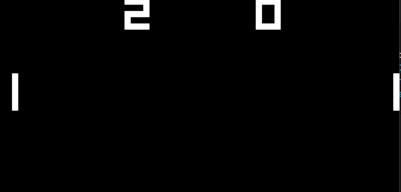

# CHIP8 emulator

CH8 is a programming language used for making CHIP8 programs,they were made in the 60s and 70s.It was interpreted and used as a replacement of languages like BASIC. It runs on a virtual machine,usually implemented on 4K systems like Cosmac VIP and Telmac 1800.

# Virtual machine specifications

- RAM: 4KB (512bytes reserved for CHIP8 fontset,stack and display refresh). 
- Registers: 16 V0 to VF 16 bit registers.
- Stack: Used to store adresses during subroutines,16 levels.
- Delay timer
- Sound timer
- Hex keyboard with 16 keys
- Display: Monochrome 64x32 scaled 10 times

## Opcode table

CHIP8 has 35 official opcodes.Symbols:
- NNN: address
- NN: 8-bit constant
- N: 4-bit constant
- X and Y: 4-bit register identifier
- PC : Program Counter
- I : 12bit register (For memory address) (Similar to void pointer)
- VN: One of the 16 available variables. N may be 0 to F (hexadecimal)

| Opcode                                                              | Type     | C Pseudocode                                                                 | Explanation                                                                                                                                                                                                                                                                                                                                                                                     |
|------------------------------------------------------------------------|-------------|---------------------------------------------------------------------------------|----------------------------------------------------------------------------------------------------------------------------------------------------------------------------------------------------------------------------------------------------------------------------------------------------------------------------------------------------------------------------------------------------|
| .mw-parser-output .monospaced{font-family:monospace,monospace}0NNN  | Call     |                                                                              | Calls machine code routine (RCA 1802 for COSMAC VIP) at address NNN.  Not necessary for most ROMs.[23]                                                                                                                                                                                                                                                                                          |
| 00E0                                                                | Display  | disp_clear()                                                                 | Clears the screen.[23]                                                                                                                                                                                                                                                                                                                                                                          |
| 00EE                                                                | Flow     | return;                                                                      | Returns from a subroutine.[23]                                                                                                                                                                                                                                                                                                                                                                  |
| 1NNN                                                                | Flow     | goto NNN;                                                                    | Jumps to address NNN.[23]                                                                                                                                                                                                                                                                                                                                                                       |
| 2NNN                                                                | Flow     | *(0xNNN)()                                                                   | Calls subroutine at NNN.[23]                                                                                                                                                                                                                                                                                                                                                                    |
| 3XNN                                                                | Cond     | if (Vx == NN)                                                                | Skips the next instruction if VX equals NN (usually the next instruction is a jump to skip a code block).[23]                                                                                                                                                                                                                                                                                   |
| 4XNN                                                                | Cond     | if (Vx != NN)                                                                | Skips the next instruction if VX does not equal NN (usually the next instruction is a jump to skip a code block).[23]                                                                                                                                                                                                                                                                           |
| 5XY0                                                                | Cond     | if (Vx == Vy)                                                                | Skips the next instruction if VX equals VY (usually the next instruction is a jump to skip a code block).[23]                                                                                                                                                                                                                                                                                   |
| 6XNN                                                                | Const    | Vx = NN                                                                      | Sets VX to NN.[23]                                                                                                                                                                                                                                                                                                                                                                              |
| 7XNN                                                                | Const    | Vx += NN                                                                     | Adds NN to VX (carry flag is not changed).[23]                                                                                                                                                                                                                                                                                                                                                  |
| 8XY0                                                                | Assig    | Vx = Vy                                                                      | Sets VX to the value of VY.[23]                                                                                                                                                                                                                                                                                                                                                                 |
| 8XY1                                                                | BitOp    | Vx |= Vy                                                                     | Sets VX to VX or VY. (bitwise OR operation).[23]                                                                                                                                                                                                                                                                                                                                                |
| 8XY2                                                                | BitOp    | Vx &amp;= Vy                                                                 | Sets VX to VX and VY. (bitwise AND operation).[23]                                                                                                                                                                                                                                                                                                                                              |
| 8XY3[a]                                                             | BitOp    | Vx ^= Vy                                                                     | Sets VX to VX xor VY.[23]                                                                                                                                                                                                                                                                                                                                                                       |
| 8XY4                                                                | Math     | Vx += Vy                                                                     | Adds VY to VX. VF is set to 1 when there's an overflow, and to 0 when there is not.[23]                                                                                                                                                                                                                                                                                                         |
| 8XY5                                                                | Math     | Vx -= Vy                                                                     | VY is subtracted from VX. VF is set to 0 when there's an underflow, and 1 when there is not. (i.e. VF set to 1 if VX &gt;= VY and 0 if not).[23]                                                                                                                                                                                                                                                |
| 8XY6[a]                                                             | BitOp    | Vx &gt;&gt;= 1                                                               | Shifts VX to the right by 1, then stores the least significant bit of VX prior to the shift into VF.[b][23]                                                                                                                                                                                                                                                                                     |
| 8XY7[a]                                                             | Math     | Vx = Vy - Vx                                                                 | Sets VX to VY minus VX. VF is set to 0 when there's an underflow, and 1 when there is not. (i.e. VF set to 1 if VY &gt;= VX).[23]                                                                                                                                                                                                                                                               |
| 8XYE[a]                                                             | BitOp    | Vx &lt;&lt;= 1                                                               | Shifts VX to the left by 1, then sets VF to 1 if the most significant bit of VX prior to that shift was set, or to 0 if it was unset.[b][23]                                                                                                                                                                                                                                                    |
| 9XY0                                                                | Cond     | if (Vx != Vy)                                                                | Skips the next instruction if VX does not equal VY. (Usually the next instruction is a jump to skip a code block).[23]                                                                                                                                                                                                                                                                          |
| ANNN                                                                | MEM      | I = NNN                                                                      | Sets I to the address NNN.[23]                                                                                                                                                                                                                                                                                                                                                                  |
| BNNN                                                                | Flow     | PC = V0 + NNN                                                                | Jumps to the address NNN plus V0.[23]                                                                                                                                                                                                                                                                                                                                                           |
| CXNN                                                                | Rand     | Vx = rand() &amp; NN                                                         | Sets VX to the result of a bitwise and operation on a random number (Typically: 0 to 255) and NN.[23]                                                                                                                                                                                                                                                                                           |
| DXYN                                                                | Display  | draw(Vx, Vy, N)                                                              | Draws a sprite at coordinate (VX, VY) that has a width of 8 pixels and a height of N pixels. Each row of 8 pixels is read as bit-coded starting from memory location I; I value does not change after the execution of this instruction. As described above, VF is set to 1 if any screen pixels are flipped from set to unset when the sprite is drawn, and to 0 if that does not happen.[23]  |
| EX9E                                                                | KeyOp    | if (key() == Vx)                                                             | Skips the next instruction if the key stored in VX(only consider the lowest nibble) is pressed (usually the next instruction is a jump to skip a code block).[23]                                                                                                                                                                                                                               |
| EXA1                                                                | KeyOp    | if (key() != Vx)                                                             | Skips the next instruction if the key stored in VX(only consider the lowest nibble) is not pressed (usually the next instruction is a jump to skip a code block).[23]                                                                                                                                                                                                                           |
| FX07                                                                | Timer    | Vx = get_delay()                                                             | Sets VX to the value of the delay timer.[23]                                                                                                                                                                                                                                                                                                                                                    |
| FX0A                                                                | KeyOp    | Vx = get_key()                                                               | A key press is awaited, and then stored in VX (blocking operation, all instruction halted until next key event, delay and sound timers should continue processing).[23]                                                                                                                                                                                                                         |
| FX15                                                                | Timer    | delay_timer(Vx)                                                              | Sets the delay timer to VX.[23]                                                                                                                                                                                                                                                                                                                                                                 |
| FX18                                                                | Sound    | sound_timer(Vx)                                                              | Sets the sound timer to VX.[23]                                                                                                                                                                                                                                                                                                                                                                 |
| FX1E                                                                | MEM      | I += Vx                                                                      | Adds VX to I. VF is not affected.[c][23]                                                                                                                                                                                                                                                                                                                                                        |
| FX29                                                                | MEM      | I = sprite_addr[Vx]                                                          | Sets I to the location of the sprite for the character in VX(only consider the lowest nibble). Characters 0-F (in hexadecimal) are represented by a 4x5 font.[23]                                                                                                                                                                                                                               |
| FX33                                                                | BCD      | set_BCD(Vx) *(I+0) = BCD(3); *(I+1) = BCD(2); *(I+2) = BCD(1);   | Stores the binary-coded decimal representation of VX, with the hundreds digit in memory at location in I, the tens digit at location I+1, and the ones digit at location I+2.[23]                                                                                                                                                                                                               |
| FX55                                                                | MEM      | reg_dump(Vx, &amp;I)                                                         | Stores from V0 to VX (including VX) in memory, starting at address I. The offset from I is increased by 1 for each value written, but I itself is left unmodified.[d][23]                                                                                                                                                                                                                       |
| FX65                                                                | MEM      | reg_load(Vx, &amp;I)                                                         | Fills from V0 to VX (including VX) with values from memory, starting at address I. The offset from I is increased by 1 for each value read, but I itself is left unmodified.[d][23]                                                                                                                                                                                                             |

# Features
- 5 ROMs to test the emulator
- Program menu in terminal for choosing the program
- Booting the program
- Showing graphics
- Sound
- Keyboard input
- Logs of things happening inside the emulator

# How to use it

1. Clone the repository or download the ZIP file containing this repo.
2. Place the ROMs inside the compiler directory(usually the bin folder,depends on the compiler).
3. Build and run the program.
4. In terminal,write the name of the program (it has to be written exactly as written in the menu).
5. Enjoy!

**NOTES**: Controls depends on the game,but usually it is W,S,Q,2,8,4 keys on the keyboard.For more ROMs,visit this repo: [ROMs](https://github.com/dmatlack/chip8/tree/master/roms)
 Some games require less CPU cycles while some of them don't,there is a chance that the game is faster or unplayable because of too much or less cycles.

This emulator works for all the programs in the ROM file.Please keep in mind this is a simulation of an original CHIP8 emulator.This emulator does not support Super-CH8 or other CH8 ROM variations.
# Technologies used:

- *C++* - used for opcodes,timing,graphics,memory.
- *SDL* - used for rendering graphics and input.

# Examples

